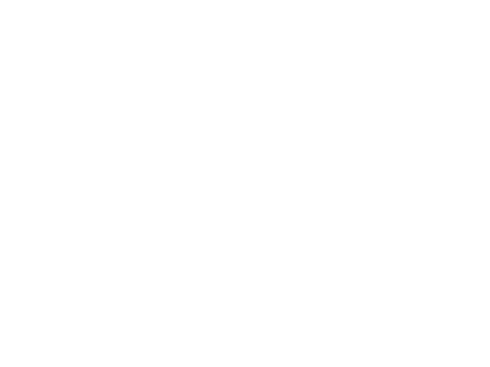

# [Protein Structure and Sequence Co-Design through Graph Based Generative Diffusion Modeling](https://repository.tudelft.nl/record/uuid:08ddfafd-1eac-4e53-b0fc-837ad39cb6df)

This project implements a graph-based generative diffusion model for the co-design of protein structures and sequences. It was developed as a master's thesis at TU Delft.

## Abstract

Proteins are fundamental biological macromolecules essential for cellular structure, enzymatic catalysis, and immune defense, making the generation of novel proteins crucial for advancements in medicine, biotechnology, and material sciences. This study explores protein design using deep generative models, specifically Denoising Diffusion Probabilistic Models (DDPMs). While traditional methods often focus on either protein structure or sequence design independently, recent trends emphasize a co-design approach addressing both aspects simultaneously. We propose a novel methodology utilizing Equivariant Graph Neural Networks (EGNNs) within the diffusion framework to co-design protein structures and sequences. We modify the EGNN architecture to improve its effectiveness in learning intricate data patterns. Experimental results show that our approach effectively generates high-quality protein sequences, although challenges remain in producing plausible protein backbones and ensuring strong sequence-structure correlation.

## Installation

### Prerequisites

## Usage

### Example

### Arguments

## Project Structure

## Features

- Data preprocessing (handling missing values, normalization, etc.)
- Model training and evaluation
- Saving and loading trained models
- Generating protein structures and sequences

## Contributing

Contributions are welcome! To contribute:

1. Fork the repository.
2. Create a new branch (`git checkout -b feature-branch`).
3. Commit your changes (`git commit -am 'Add new feature'`).
4. Push to the branch (`git push origin feature-branch`).
5. Create a new Pull Request.

## License

This project is licensed under the MIT License - see the [LICENSE](LICENSE) file for details.

## Authors

- **M.H. Bhuradia** - *Master's thesis* - [TU Delft](https://www.tudelft.nl/)

## Contributors

- **J.M. Weber** - Pattern Recognition and Bioinformatics - EEMCS (mentor)
- **H. Jamali-Rad** - Pattern Recognition and Bioinformatics - EEMCS (mentor)
- **A.O. Villegas Morcillo** - Pattern Recognition and Bioinformatics - EEMCS (mentor)
- **M.J.T. Reinders** - Pattern Recognition and Bioinformatics - EEMCS (graduation committee member)
- **J.W. Böhmer** - Sequential Decision Making - EEMCS (graduation committee member)

